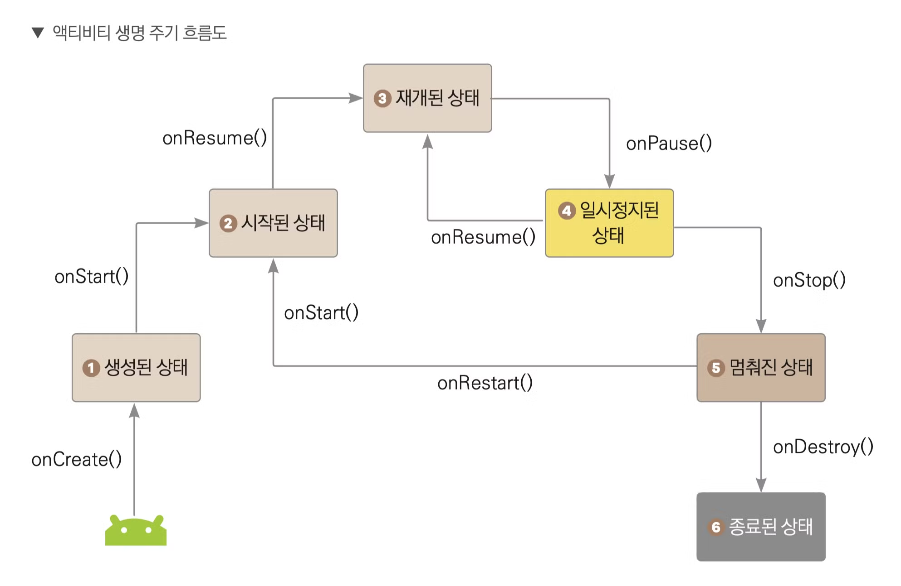
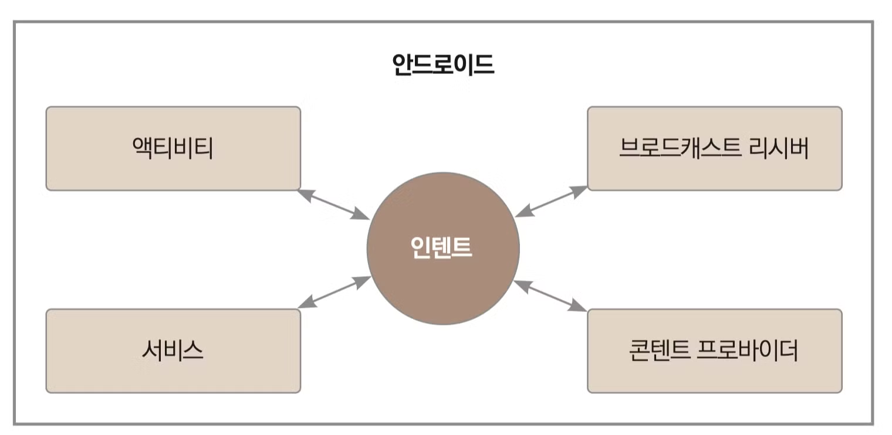

# 안드로이드 4대 구성요소

안드로이드에서 가장 중요한 4대 구성요소가 있다.

- 액티비티(프래그먼트): 사용자에게 유저 인터페이스를 제공한다. (각각의 화면을 말한다.)
- 서비스: 백그라운드 조작을 수행한다.
    - 예를 들어, 다른 어플을 다운받으면서 내가 진행하는 작업을 수행할 수 있는 것이다.
- 브로드캐스트 리시버: 앱의 밖에서 일어난 이벤트를 앱에 전달한다.
    - 예를 들어, 배터리가 5% 밖에 안남았을 때 기능을 제한한다던지 등등
- 콘텐트 프로바이더: 데이터를 관리하고, 다른 앱의 데이터를 사용할 수 있게 한다.
    - 카카오톡이 주소록에 있는 연락처를 콘텐트 프로바이더를 통해 가져온다.

## 액티비티

위의 4대 구성요소를 모두 사용할 필요없고, 필요할 때 사용하면 된다. 다만, 액티비티의 경우 반드시 필요하다.

- 액티비티란, 화면의 기본 구성 단위이다. 액티비티는 사용자 인터페이스를 보여주고, 터치하고 아이디 인풋을 입력하는 등 여러 상호작용을 가능하게 한다.

### 액티비티 생명주기

어떤 프레임워크나 툴을 배울 때는 해당하는 생명주기를 배우는 것이 좋다.



- `onCreate()`: 액티비티를 처음 시작할 때 실행된다. 레이아웃 지정이나, 변수 초기화 등 기본적인 앱 시작 로직을 여기서 구현해준다.
- `onStart()`: 액티비티가 시작된 상태에 들어가기 직전에 실행된다. 액티비티가 사용자에게 보여주지만, 유저와의 이벤트 상호작용은 아직 준비하는 단계이다. UI 관련 로직을 초기화하는 코드를 작성한다.
- `onResume()`: 액티비티가 재개된 상태에 들어가기 직전에 실행된다. 이때는 액티비티와 사용자의 상호작용이 가능해진다. 전화가 온다거나, 사용자가 다른 액티비티로 이동하는 등 포커스를 잃는 경우가 아닌 이상 액티비티는 재개된 상태로 존재한다.
- `onPause()`: 유저가 액티비티를 떠나는 경우 처음 실행되는 콜백함수이다. 주의할 점은 `onPause` 함수는 지속시간이 매우 짧기 때문에 부하가 큰 작업은 다음 콜백인 `onStop()` 함수를 사용해야 한다.
    - 홈 버튼을 눌렀을 때 메모리 우선순위에 뒤로 밀려나게 되고, 아직 액티비티는 메모리에 남아있는 상태이다.
- `onStop()`: 액티비티가 사용자에게 더이상 표시안되는 중단된 상태에 들어가기 직전에 실행되는 콜백함수이다.
- `onRestart()`: 다시 앱을 사용했을 때 실행된다.
    - 여기서 중요한점은 `onRestart` 함수가 실행되고 다시 `onCreate` 함수가 실행되는 것이 아닌 `onStart` 함수가 실행된다는 것이다.
    - 예외는 있는데, 백그라운드의 앱들이 너무 많아서 메모리가 부족할 경우 앱이 강제로 종료되는 경우가 가끔 있다. 이 때는 `onCreate` 함수부터 다시 실행된다는 것을 기억하자.
- `onDestory()`: 액티비티가 완전히 소멸되기 직전에 호출되는 함수이다.
    - 앱을 뒤로가기 누르거나 종료 버튼을 클릭하게 되면 `onPause`, `onStop`, `onDestroy` 함수를 거쳐서 액티비티가 완전히 종료된다.

### 액티비티 화면전환 -> 인텐트

인텐트(intent)란, 앱을 사용하면서 수많은 화면 전환(액티비티 전환)이 일어나게 되는데 이 때 필요한 객체가 바로 인텐트 객체이다.



- 액티비티간의 전환 뿐만 아니라 4대 구성요소간의 전환에도 인텐트 객체를 반드시 사용해야 한다.

#### 문법

```kotlin
val intent = Intent(this, SubActivity::class.java)
startActivity(intent)
```

<br>
<br>
<br>

## References

- [[2023 코틀린 강의 무료제공] 기초에서 수익 창출까지, 안드로이드 프로그래밍 A-Z](https://www.inflearn.com/course/%EC%8C%A9%EC%B4%88%EB%B3%B4-%EC%95%88%EB%93%9C%EB%A1%9C%EC%9D%B4%EB%93%9C-%ED%94%84%EB%A1%9C%EA%B7%B8%EB%9E%98%EB%B0%8D-%EC%88%98%EC%9D%B5)