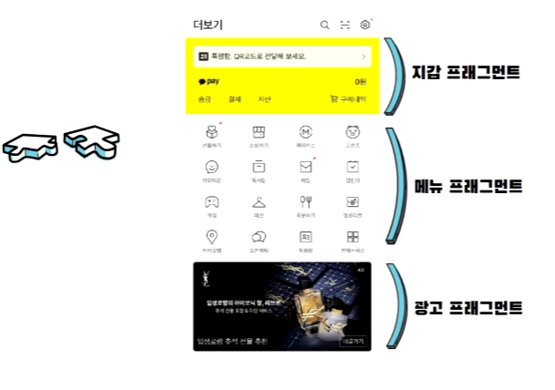
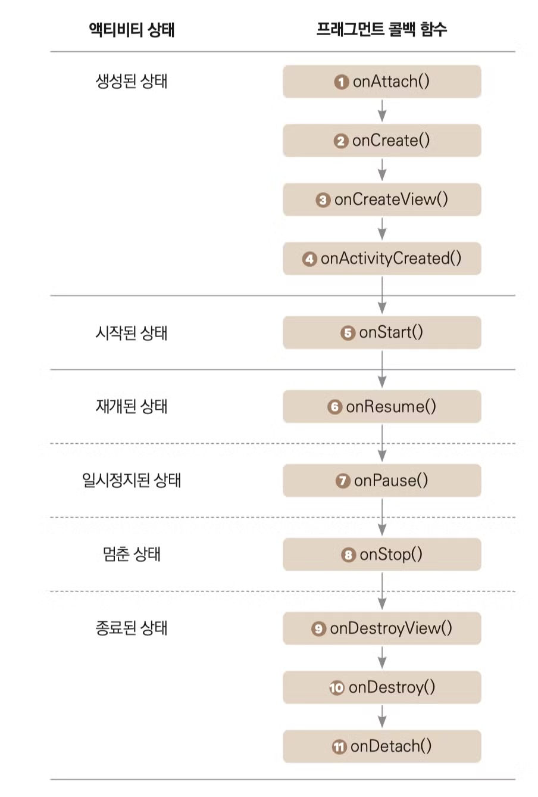

# 프래그먼트

- 프래그먼트(Fragment)의 사전적 의미로는 조각, 파편의 의미로 액티비티처럼 사용자 인터페이스를 제공한다는 점에서 비슷하지만 조각처럼 나누어져있다.
- React 라이브러리의 컴포넌트를 생각하면 편하다.
- 즉, 다른 액티비티에서 이 프래그먼트를 재활용할 수 있다.
- 또한 가볍기 때문에 모던 안드로이드 프로그래밍에서 굉장히 많이 쓰인다.



## 특징

- 반드시 액티비티 안에 종속되어야 한다.
- 액티비티의 생명주기에 영향을 받지만, 프래그먼트 고유의 생명주기가 존재한다.
- 액티비티가 실행중일 때 프래그먼트를 추가하거나 제거할 수 있다.

## 생명주기



- `onAttach()`: 해당 프래그먼트가 액티비티에 추가되었다는 것을 알려준다.
- `onCreate()`: 프래그먼트가 최초로 생성된 시점에 호출되는 함수이다. 프래그먼트를 초기화하는 코드를 넣는다.
- `onCreateView()`: 프래그먼트에서 정말 중요한 콜백 함수이다. 프래그먼트에 그릴 뷰를 생성할 때 호출되는 함수이다. 이 함수에서 렌더링될 뷰를 반환해야 한다.
- `onActivityCreated()`: `onCreate` 함수가 완료되고 나서 실행되는 함수이다. 액티비티 생성후에 프래그먼트에서 해주어야 할 작업을 여기에서 처리한다.
- `onStart()`: 사용자에게 프래그먼트가 보이기 시작할 때 실행된다.
- `onResume()`: 유저와 상호작용 할 수 있게 된다. 이 때 유저가 프래그먼트를 떠나지 않는 이상 계속 재개된 상태를 유지한다.
- `onPause()`: 유저가 프래그먼트를 떠날 때 처음 불러지는 콜백함수이다. 이 때 불필요한 리소스들을 해제한다.
- `onStop()`: 프래그먼트가 유저에게 더이상 보이지 않을 때 호출되는 콜백함수이다.
- `onDestroyView()`: `onActivityCreated` 함수와 반대로 여기서는 뷰 리소스들을 해제해준다.
- `onDestroy()`: 프래그먼트가 마지막으로 완전히 삭제되기 전에 호출되는 함수이다.
- `onDetach()`: `onAttach` 함수와 반대로 액티비티와의 연결을 끊기 전에 호출된다.

## 프래그먼트간의 화면전환 

```kotlin
val fragmentTransaction = supportFragmentManager.beginTransaction()
fragmentTransaction.replace(R.id.frame_layout, RedFragment())
fragmentTransaction.commit()
```

- 프래그먼트에서 화면전환을 하려면 FragmentTransaction 객체를 가져와야 한다.

<br>
<br>
<br>

## References

- [[2023 코틀린 강의 무료제공] 기초에서 수익 창출까지, 안드로이드 프로그래밍 A-Z](https://www.inflearn.com/course/%EC%8C%A9%EC%B4%88%EB%B3%B4-%EC%95%88%EB%93%9C%EB%A1%9C%EC%9D%B4%EB%93%9C-%ED%94%84%EB%A1%9C%EA%B7%B8%EB%9E%98%EB%B0%8D-%EC%88%98%EC%9D%B5)