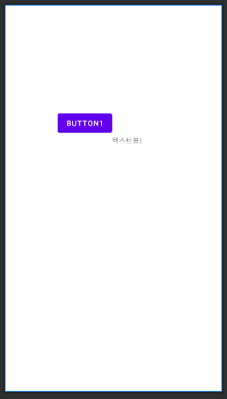

# 레이아웃(Layout)

| 레이아웃이란

레이아웃은 뷰 그룹의 일종으로 뷰를 배치하는 역할을 한다.

| 레이아웃 종류


- **리니어(Linear)**: 수직방향(위->아래) 혹은 수평방향(왼쪽->오른쪽) 차례로 주어진 뷰를 정렬한다.
- **상대적(Relative)**: 말 그대로 다른 뷰들로부터 위치를 지정하거나 부모 레이아웃을 기준으로 위치를 정하는 등 상대 기준으로 정렬한다.
- **컨스트레인트(Contraint)**: 뷰 사이에 수평, 수직 방향의 제약을 주어 뷰들을 위치시킨다.
- **테이블(Table)**: 뷰를 행과 열로 구성하여 테이블 형태로 정렬한다.
- **프레임(Frame)**: 뷰들을 액자처럼 쌓는다. 여러 뷰들을 추가하더라도 가장 나중에 추가한 뷰가 가장 위에 위치하게 된다. (CSS의 index 속성과 비슷하다.) 레이아웃 내에 여러 뷰들을 배치시키는데에 적합하지 않고, 주로 화면에 표시될 하나의 뷰를 바꿔가며 표시하는데 적합하다.

## 리니어 레이아웃

리니어 레이아웃의 속성들을 알아보자.

| **orientation (필수 속성)**

orientation 속성은 세로 방향인지 가로 방향인지 결정하는 속성이다.

- vertical (수직)
- horizental (수평)


| **layout_gravity**

layout_gravity 속성은 orientation 값이 수직 방향으로 정렬하는데, 수평 방향으로 뷰들을 조정하고 싶을 때 사용한다.

- orientation 값이 vertical일 때, 수평 방향으로 조정
- orientation 값이 horizental일 때, 수직 방향으로 조정

| **layout_weight**

layout_weight 속성은 각 뷰의 비중을 지정할 수 있다.

- weightSum: 리니어 레이아웃 속의 layout_weight을 다 더한 값
- layout_weight: 뷰들의 비중


- 위 리니어 레이아웃의 속성값
    - orientation : horizontal
    - weightSum : 4
    - 레이아웃 속 각 버튼의 속성값
        - layout_weight : 각각 차례로 1,2,1
        - layout_width: 0dp (각 버튼의 속성에 더 이상 가로 크기를 명시적으로 지정해주지 않기 때문)

## 상대적 레이아웃

| 부모 레이아웃을 기준으로 배치할 때 사용할 수 있는 속성


- 부모 레이아웃을 어떤 기준으로 배치할지 지정한다.
- 생략하면 항상 Left, Top을 기준으로 배치하게 된다.

| 뷰를 기준으로 배치할 때 사용할 수 있는 속성


- 기준이 되는 뷰는 반드시 `id` 속성값이 있어야 한다.

## 컨스트레인트 레이아웃

컨스트레인트 레이아웃은 실무에서 가장 많이 사용하는 만큼 가장 중요한 레이아웃이다. 말그대로 제약을 줌으로써, 다양한 화면 크기에 대응하는 반응형 UI를 쉽게 구성할 수 있다. 또한 중첩된 레이아웃을 사용하면 많은 리소스를 잡아먹기 때문에 앱이 느려지기 때문에 중첩된 레이아웃을 사용하지 않고도 크고 복잡한 레이아웃을 만들 수 있어 성능면에서 유용하다.

| 기본 속성

뷰의 위치를 배치시키려면 반드시 아래 두 가지를 추가해주어야 한다.

- 수직 방향 제약
- 수평 방향 제약

사용 방법은 아래와 같이 사용한다.


```xml
<Button
    android:id="@+id/button1"
    android:layout_width="wrap_content"
    android:layout_height="wrap_content"
    app:layout_constraintStart_toStartOf="parent"
    app:layout_constraintTop_toTopOf="parent"
    android:layout_marginStart="100dp"
    android:layout_marginTop="200dp"
    android:text="button1"/>

<TextView
    android:layout_width="wrap_content"
    android:layout_height="wrap_content"
    android:text="텍스트뷰!"
    app:layout_constraintTop_toBottomOf="@+id/button1"
    app:layout_constraintStart_toEndOf="@+id/button1" />
```



- 참고로 컨스트레인트 레이아웃에서 제약을 주어야 마진이 적용된다.
- 다른 뷰를 기준으로 제약을 추가해줄 수 있다.

| 0dp

높이나 너비에 제약을 맞추는 것과 같다.


- `layout_width=wrap_content`는 크기가 텍스트 크기에 맞춰진다.
- 제약은 `EndtoEndOf`로 BUTTON1의 끝과 부모 레이아웃의 끝에 추가된 상태에서 `0dp(match_constraint)` 로 변경하게 되면 어떻게 될까?


- 제약의 시작(BUTTON1 의 끝)과 끝(부모 레이아웃의 끝)에 너비가 맞추어진다. (여백이 없어졌다.)

## 반응형 UI: Guideline


가이드라인은 실제 화면에는 보이지 않으며, 레이아웃을 구성할 때만 사용되는 도구이다. 다양한 디바이스의 해상도에서 일정한 비율로 레이아웃을 구성하고 싶을 때 굉장히 유용하게 사용할 수 있다.

| 기본 속성

- `android:orientation="vertical"`: 가이드라인의 방향 지정
- `app:layout_constraintGuide_begin="20dp"`: 시작 지점에서 몇 dp 만큼 가이드라인이 떨어지는지 지정
- `app:layout_constraintGuide_percent="0.3"`: 시작 지점에서 몇 % 만큼 가이드라인이 떨어지는지 지정 (0~1 설정, 0.3->30%)

<br>
<br>
<br>

## References

- [[2023 코틀린 강의 무료제공] 기초에서 수익 창출까지, 안드로이드 프로그래밍 A-Z](https://www.inflearn.com/course/%EC%8C%A9%EC%B4%88%EB%B3%B4-%EC%95%88%EB%93%9C%EB%A1%9C%EC%9D%B4%EB%93%9C-%ED%94%84%EB%A1%9C%EA%B7%B8%EB%9E%98%EB%B0%8D-%EC%88%98%EC%9D%B5)