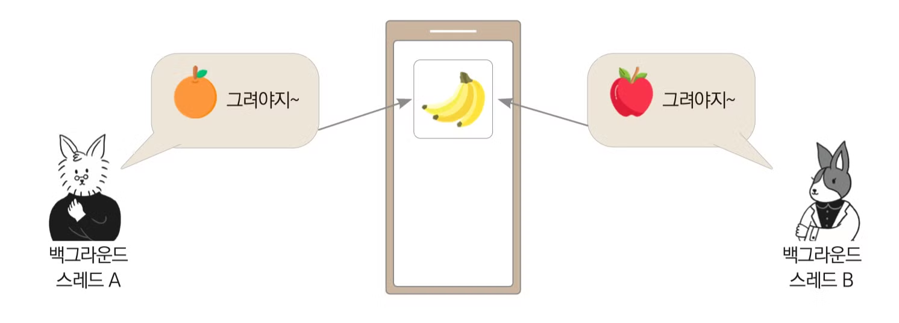
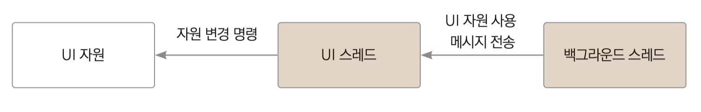

# 스레드(Thread)

스레드란 한 프로세스 내에서 실행되는 흐름의 단위이다. 안드로이드에서는 기본적으로 멀티스레드를 제공한다.

## 메인 스레드

앱이 처음 시작될 때 시스템이 스레드 하나를 생성하는데 이를 메인 스레드라 한다. 메인 스레드는 크게 두 가지 역할을 가진다.

- 액티비티의 모든 라이프 사이클 관련 콜백 실행을 담당한다.
- 버튼, 에디트텍스트와 같은 UI 위젯을 사용한 사용자와 이벤트와 UI 드로잉 이벤트를 담당한다. 따라서 이를 UI 스레드라고도 불린다.

작업량이 큰 연산이나 네트워크 통신, DB 쿼리 등은 시간이 꽤 걸린다. 만약 이 모든 작업을 메인 스레드의 큐에 넣고 작업하면 한 작업의 처리가 완료될 때까지 기다려야 한다. 그러면 유저 입장에서는 마치 앱이 먹통된 것처럼 보이게 된다.

| 몇 초 이상 메인 스레드가 멈추면 "앱이 응답하지 않습니다." 라는 메시지를 받게 된다.

## 백그라운드 스레드

위처럼 부하가 큰 경우 백그라운드 스레드(워커 스레드라고도 불린다.)를 활용하면 해결할 수 있다. 백그라운드 스레드에서 복잡한 연산이나 네트워크 통신, DB 쿼리 가져오는 등 처리해주면 되는데, **주의할 점은 절대로 UI 관련 작업을 백그라운드 스레드에서 하면 안된다는 점이다.**



그 이유는 각 백그라운드 스레드가 언제 처리를 끝내고 UI에 접근할지 순서를 알 수 없기 때문이다. 따라서 백그라운드 스레드에서 UI 자원을 사용하려면 메인 스레드에 UI 자원 사용 메시지를 전달하는 방법을 이용해야 한다.



백그라운드 스레드에서 UI 작업을 하려면 Handler 클래스, AsyncTask 클래스, runOnUiThread 메서드 등을 활용할 수 있다.

```kotlin
public final void runOnUiThread(Runnable action) { 
    if (Thread.currentThread() != mUiThread) { 
            mHandler.post(action); 
    } else { 
            action.run(); 
    } 
}
```

- `runOnUiThread()`: UI 스레드(메인 스레드)에서 코드를 실행시킬 때 쓰는 액티비티 클래스의 메서드이다.
- 현재 스레드가 UI 스레드가 아니면 **UI 자원 사용 메시지를 전송한다.**
- 현재 스레드가 UI 스레드가 맞으면 그대로 실행한다.