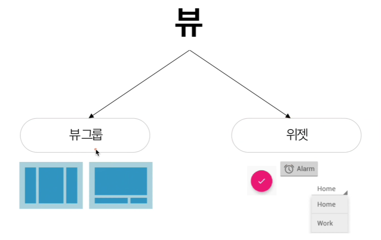
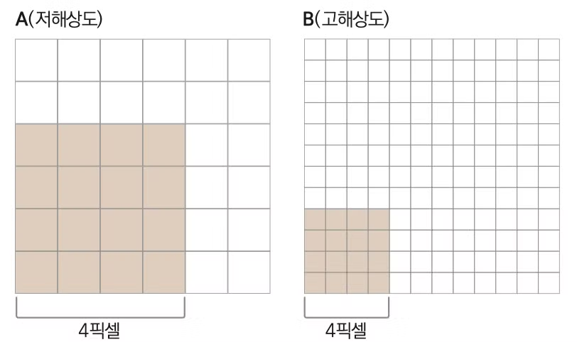
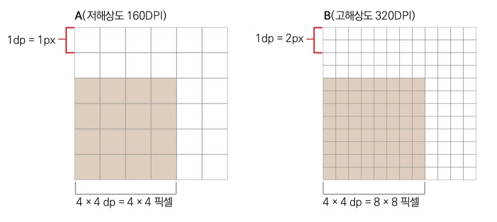
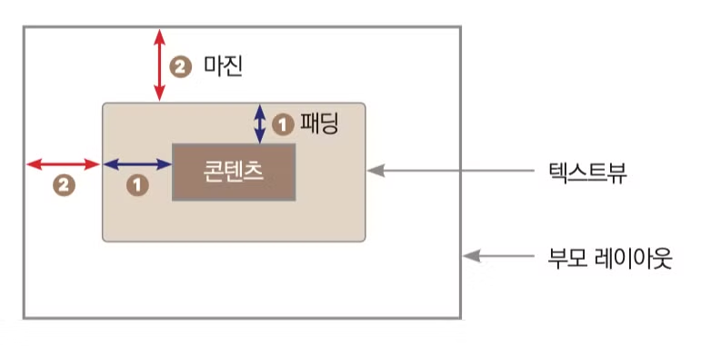

# View

| 뷰(View)란?

- 뷰(View)란, 화면에서 볼 수 있는 모든 것들을 말한다.
- 이미지는 이미지 뷰, 텍스트는 텍스트뷰를 통해서 유저에게 보여준다. (버튼, 리스트, 인풋 등등)
- 유저들이 직접 볼 수 있거나 상호작용할 수 있는 뷰를 '위젯'이라고도 불린다.

| 뷰 그룹은 무엇인가?

- 뷰 그룹은 다른 뷰나 뷰 그룹을 담을 수 있는 박스이다. 레이아웃을 설정한다.
- 뷰 그룹도 뷰에 소속된다.
- 뷰 그룹은 다양한 위젯(뷰)들을 배치할 수 있는 레이아웃이라고 이해하면 된다.

| 보편적으로 뷰 그룹은 레이아웃, 위젯은 뷰라고 부른다.

## 너비와 높이

layout_width는 뷰의 너비를 지정하고, layout_height는 뷰의 높이를 지정한다.

- `match_parent`: 부모 레이아웃의 크기에 해당 뷰를 꽉 채운다. (웹에서 `display: block`의 속성과 비슷하다.)
- `wrap_content`: 해당 뷰 안에 있는 내용에 크기를 자동으로 맞춘다. (웹에서 `display: inline`의 속성과 비슷하다.)

## dp 단위

픽셀의 경우 저해상도의 픽셀 크기와 고해상도의 픽셀 크기가 차이가 난다. 즉, 고해상도 일수록 픽셀의 크기가 작아지게 되는데 이처럼 안드로이드에서 픽셀 단위를 사용하게 되면 여러 해상도의 디바이스에서 크기가 모두 뒤죽박죽으로 보이게 된다.

그래서 픽셀의 단점을 보완한 것이 바로 `dp` 단위이다. density-independent pixel의 약자로 해상도에 독립적이라는 의미이다. 즉, 해상도에 따라 크기가 변하는 픽셀과 달리 dp는 해상도에 관계없이 이미지를 같은 크기로 표현하는 것이 가능하다. dp를 사용하면 AOS에서 기기의 해상도에 맞춰 자동으로 픽셀값을 조정해준다. 따라서 dp 단위를 사용하게 되면 안드로이드를 사용하게 되는 모든 유저들은 똑같은 크기로 볼 수 있게 된다.

안드로이드는 위 사진처럼 5가지의 대표적인 DPI가 있다. DPI는 dot per inch의 약자로 1인치당 들어가는 픽셀 개수를 뜻한다. 예를 들어, 160DPI는 1인치에 160개의 픽셀이 들어있는 것이다. DPI가 높을수록 당연히 해상도도 높다.

## 패딩과 마진

- 패딩과 마진은 웹의 CSS에서의 패딩과 마진 개념과 같다.
- `layout_marginHorizontal`: left, right만 적용
- `layout_marginVertical`: top, bottom만 적용

 
 
 

## References

- [[2023 코틀린 강의 무료제공] 기초에서 수익 창출까지, 안드로이드 프로그래밍 A-Z](https://www.inflearn.com/course/%EC%8C%A9%EC%B4%88%EB%B3%B4-%EC%95%88%EB%93%9C%EB%A1%9C%EC%9D%B4%EB%93%9C-%ED%94%84%EB%A1%9C%EA%B7%B8%EB%9E%98%EB%B0%8D-%EC%88%98%EC%9D%B5)